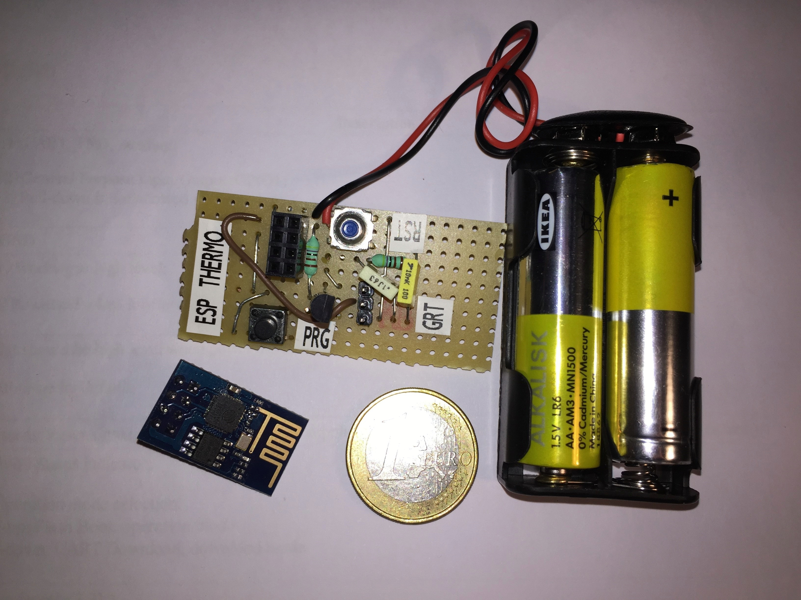

The objective of this project is to create a really inexpensive internet enabled thermometer to be able to monitor a room's temperature remotely.

>
> This is still work in progress. Please check back later.
> 

  
  
  
# Main components
Here's what you're going to need:
- ESP-01, a ESP8266 chip based WiFi module (others may also work with some modifications)
- DS18S20 digital thermometer chip (or compatible)
- 2xAA batteries or a 3V power adapter
- FTDI or USB-to-Serial (3v3!) converter (for programming the ESP8266)
- some cables, and a few discrete components (see the schematic)
- lot of patience :)

# General notes and caveats
- ESP8266 works with 3.3V, the pins are _not_ 5V tolerant!
- Use an external power supply for reliable programming (not the 3.3V from the USB converter for example)
- If you're stuck or have an issue with setting up the ESP8266, please  try looking through the materials in the [References](References and further reading) section and also try Google - chances are somebody else had that problem and you can find a solution quickly

# First steps - programming your ESP8266
Start with the installation steps from https://github.com/esp8266/Arduino#installing-with-boards-manager:
- Install the Arduino IDE 
- Install the ESP8266 core library and select the board called 'Generic ESP8266 Module'

Wire up your ESP module on a breadboard as explained in https://github.com/esp8266/Arduino/blob/master/doc/boards.md#minimal-hardware-setup-for-bootloading-and-usage
- Use an external power source (do not use the USB-to-serial adapter's VCC)
- GND, TX and RX should be connected to the serial adapter's GND, RX and TX, respectively
- CH_PD (chip enable) should be connected the VCC (10k pull-up resistor recommended)
- RST and GPIO0 should be pulled-up to VCC
  * For convenience, add a switch or push button to be able to pull each down to GND momentarily
- Leave GPIO2 unconnected

Now load the Sketch from File/Examples/ESP8266/Blink
- Fill in your WiFi ssid and password
- 'Verify' should show no errors

Now you're ready to flash you first program to the ESP8266! Make sure that you have the Board setting in Arduino IDE set correctly:

  

Then put the ESP bootloader into programming mode:
- Open the Serial Monitor in Arduino IDE (Tools/Serial Monitor)
  * Choose the proper COM port
  * Choose 74880 baud (this is necessary in order to see bootloader messages properly)
- On the board, connect both `RST` and `GPIO0` to GND (push the buttons if you have added them)
- Release RST (connect back to VCC), while `GPIO0` is still at GND
- In the Serial Monitor you should see the following message from the bootloader:

    ```
     ets Jan  8 2013,rst cause:2, boot mode:(1,6)
    ```
    This means that the module is now in serial programming mode and ready to receive the new firmware.
- `GPIO0` can now be released back to VCC
- Select Sketch/Upload

In a short while the upload should finish without errors. If everything went fine the blue LED on the board will start blinking. You can now reset the board by connecting `RST` to GND momentarily. Make sure that `GPIO0` is _not_ connected to GND otherwise you will enter the programming mode again.

At this point I suggest you to play around with your ESP8266. Try changing the example or try other sketches. Look at the the list of functions in the [included libraries](https://github.com/esp8266/Arduino/blob/master/doc/libraries.md) and try to use them in your program.

You can use the `Serial.print()` family of functions to print diagnostic messages that you can then read in the Serial Monitor. Set the baud rate to 74880 to make it consistent with the bootloader via `Serial.begin(74880)`.

Once you feel comfortable programming your ESP8266, come back here and read on.

# Building the thermometer
## The circuit

   

Explanation:
- U1 is a 2x4 DIP header for connecting the ESP module
- SERIAL is a 1x3 DIP header for connecting a serial interface
  * Connect GND, TX and RX to your USB-toSerial adapter's GND, RX and TX, respectively
  * Double-check that the adapter uses 3.3V signal levels
- RST and PRG are push buttons, activating RESET and Programming mode, respectively
  * to simply reset the board, push RST
  * to enter programming mode 
    + push RST then PRG (keep both pushed)
    + Release RST then PRG
- C2 is across the rails, try to put it close to the module power pins (increases stability of the board)
- R1 and C1 is an RC delay circuit for reliable deep sleep operation
  * purpose is to keep CH_PD low for enough time for the board to properly reset upon waking from deep sleep
  * only applies if your GPIO16 is tied to CH_PD
- U2 is the digital thermometer chip (DS18S20)
- R2 is a pull-up

## Ubidots
- Register at Ubidots
- Create a source with two variables:
  * Temperature (unit: C)
  * Battery voltage (unit: mV)
- Note your API token and the ID of these two variables

## The software
Download and edit the [source](src/ESPThermometer/ESPThermometer.ino)
- Fill in you SSID and WiFi credentials
- Fill in your Ubidots token and variable IDs (from above)

Connect your circuit to the serial adapter. Make sure the serial interface is connected to the USB-to-serial adapter properly (see above) and the adapter is plugged in to an USB port on your computer

Connect the power rails to an external 3.3V power source (e.g. 2xAA battery or a stabilized wall adapter)
- In general anything between 2.7 - 3.3 V should work
- Do **not** use the serial adapter's VCC

Once you have everything connected, you should dowload the program to the module
- Put the module into program mode (push RST, PRG and then release RST, PRG)
- Verify that you get the correct bootloader prompt - see [](First steps - programming your ESP8266)
- Load the program into the Arduino IDE and upload (make sure to use the same settings as in [](First steps - programming your ESP8266)
- Rest the board for good measure (push and release RST)

If everything went well you should see an output similar to this in the serial monitor:

```
 ets Jan  8 2013,rst cause:2, boot mode:(3,6)

load 0x4010f000, len 1384, room 16 
tail 8
chksum 0x2d
csum 0x2d
v3ffe8654
~ld
à
ESP Thermometer starting...
Chip ID: [<your chip ID here>]

VCC = 2581 mV
Requesting temperatures...DONE
TEMP = 26.6 C
Connecting and sending...
.......WiFi connected
IP address: 
192.168.178.44
Posting your variables
HTTP/1.1 200 OK
Server: nginx
Date: Wed, 31 Aug 2016 20:18:29 GMT
Content-Type: application/json
Transfer-Encoding: chunked
Connection: close
Vary: Accept-Encoding
Vary: Accept
Allow: POST, OPTIONS

2c
[{"status_code": 201}, {"status_code": 201}]
0

Entering deep sleep [ 557s ] ...

 ets Jan  8 2013,rst cause:1, boot mode:(3,6)

[... and so on ...]

```

# Running from a battery
I was able to run this project from 2 AA batteries for about 2 weeks - not great but not that bad either. Let's dig a little bit into how this was made possible and what can you do to further improve battery life.

- Deep sleep
- Power LED!
- Further work
  * proper deep sleep (GPIO16 to RST) with less frequent RF calibration
  * use higher capacity batteries (e.g. D or A)
  * update less frequently

# What's next?
There are a lot of ways to further improve and extend this project. Here are a few ideas and pointers to get you started.

- Dynamic WiFi setup
- Dynamic Ubidots variable setup based on Chip ID
- Implement additional hardware functions:
  * connect a second sensor, e.g. for humidity or light
  * add relay switch and control it through Ubidots
  * replace Ubidots with some other (maybe custom) platform
- Extend battery life (see above)

# References and further reading
TBD
